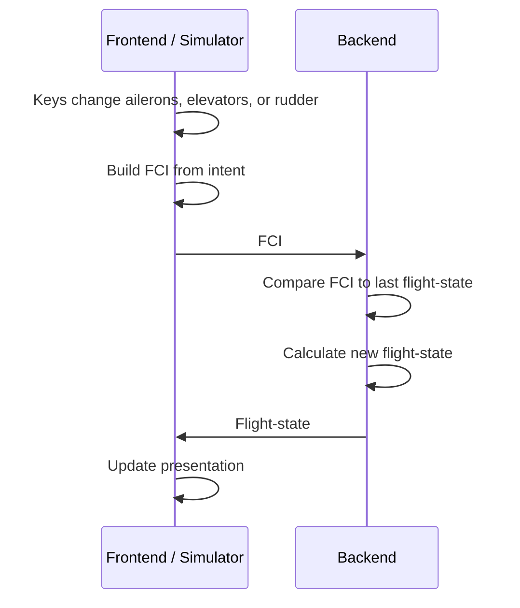
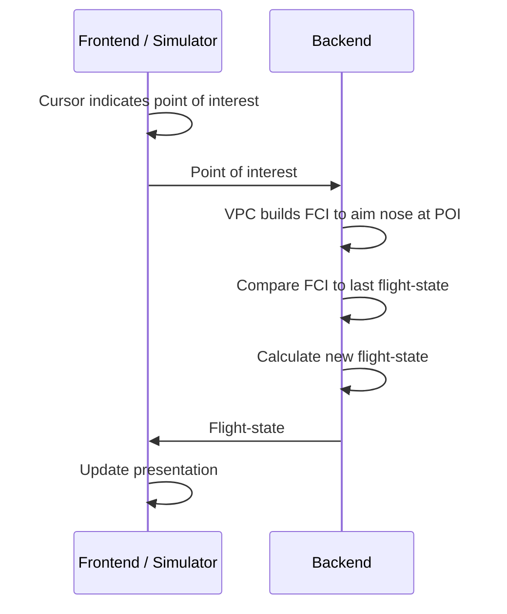

# Boundary (front end / back end)

Ground truth is a separation between the front end and the back end. When the game is multiplayer, players send information to a centralized game server running the FlightEngine, which owns the ground truth. The FlightEngine simulates the next step and returns something for the player.

## Policies

- Only cardinal values pass the boundary layer.
- Values that can be calculated from the cardinal values are owned by the front end.
  - Example: altitude is defined as the Y position, therefore we don't pass altitude across the boundary layer because it can always be calculated.
- Clear designations of what gets passed across the boundary.

## Boundary contract

The FlightEngine is a functional stand-alone backend that can power a front end (or a simulator/tests).

Each tick the flight engine takes:

1. the last **flight-state**
2. the current **FCI**

and produces a new **flight-state**.

### Objects that cross the boundary

| Object | Direction | Contents |
|--------|-----------|----------|
| **FCI** | front → back | Control-surface intent (aileron, elevator, rudder). Sent by the front end, or simulated for tests. |
| **Flight-state** | back → front | Position, rotation, linear velocity, angular velocity of the plane. |

## Control flows

In both flows, the backend owns simulation truth. The front end owns input intent (FCI) and presentation of the returned flight-state.

### Direct control (keys / control surfaces)

### VPC / flight-cursor control

